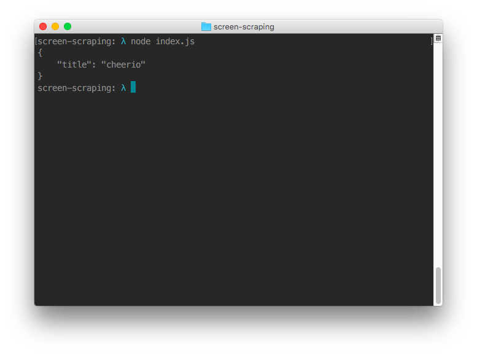
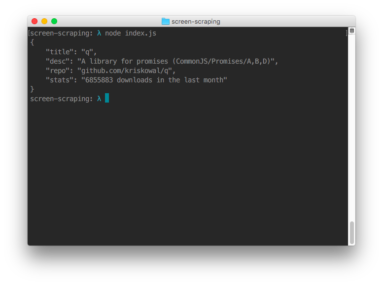

Herhangi bir siteden istediğiniz verileri jQuery core komutlarıyla alabilirsiniz. Bunun için `request` ve `cheerio` npm modullerini kullanacağız.

`request` ile indirdiğimiz datayı `cheerio` kullanarak jQuery gibi işlem yapacağız.

----


###  packages.json

```
{
  "name": "screen-scraping",
  "version": "0.0.1",
  "description": "Nodejs ile screen scraping",
  "main": "index.js",
  "scripts": {
    "start": "node index.js"
  },
  "author": "Arif Cakiroglu <cakirogluarif@gmail.com> (http://www.arifcakiroglu.com)",
  "license": "ISC",
  "dependencies": {
    "cheerio": "^0.19.0",
    "request": "^2.65.0"
  }
}
```


`packages.json` dosyasını oluşturduktan sonra `npm install` komutunu çalıştırıyoruz.

Npm modulleri proje dosyamıza node_modules klasörüne inecektir. Daha sonra `index.js` dosyası oluşturuyoruz.


### index.js


Öncelikle node modullerimizi çağırıyoruz.

```

var request = require('request');
var cheerio = require('cheerio');

```


Url olarak static bir url ekliyorum: `var url = 'https://www.npmjs.com/package/q';`

Url sonundaki 'q' yerine herhangi bir npm modulü yazabilirsiniz.


```
request(url, function(error, response, html){
  if(!error){
    // request ile çağırdığımız urlden gelen html datayı '$' olarak yeniden tanımlıyoruz.
    var $ = cheerio.load(html);

    // Çıktı için json objesi oluşturuyorum
    var json = {};
  }
});
```

cheerio modulü hakkında daha fazla bilgi almak için [reposu](https://github.com/cheeriojs/cheerio)

```
/* Modül isminin bulunduğu yeri inspectElement ile bulup alıyorum.
 * .package-name class'ını seçiyorum ve datasını json objesine title olarak atıyorum
 * daha sonra bu datayı console.log() ile yazdıracağız.
 */

$('.package-name').filter(function(){
  json.title = $(this).text().trim()
});


console.log(JSON.stringify(json, null, 4));

```

ve çıktı olarak name'ini alıyoruz





description, repository ve toplam download sayısını da alıyoruz

```

// Description
$('.package-description').filter(function(){
  json.desc = $(this).text().trim()
});


// Repository
$('.box li').eq(2).filter(function(){
  json.repo = $(this).text().trim()
});


// Total download
$('.collaborators').next().next().filter(function(){
    json.stats = $(this).children().eq(2).text().replace(/\s+/g, ' ').trim();
});

```





Kısaca cheerio kullanarak screen scraping için basit bir örnek oluşturduk.

Daha sonrası için [phanthopjs](http://phantomjs.org/) ile bir uygulama yapacağız. Yazınca buray ekleyeceğim linkini.


### Okuduğunuz için teşekkür ederim.


* [Tüm Github repositorileri](https://github.com/nodejs-dersleri)


---
