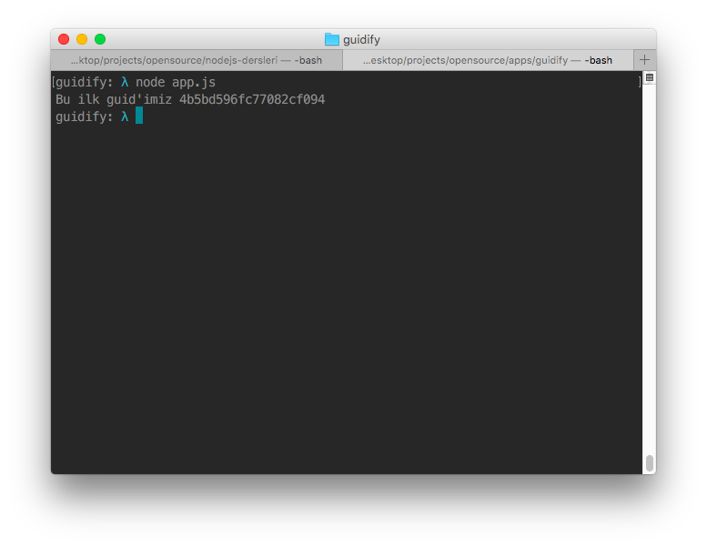
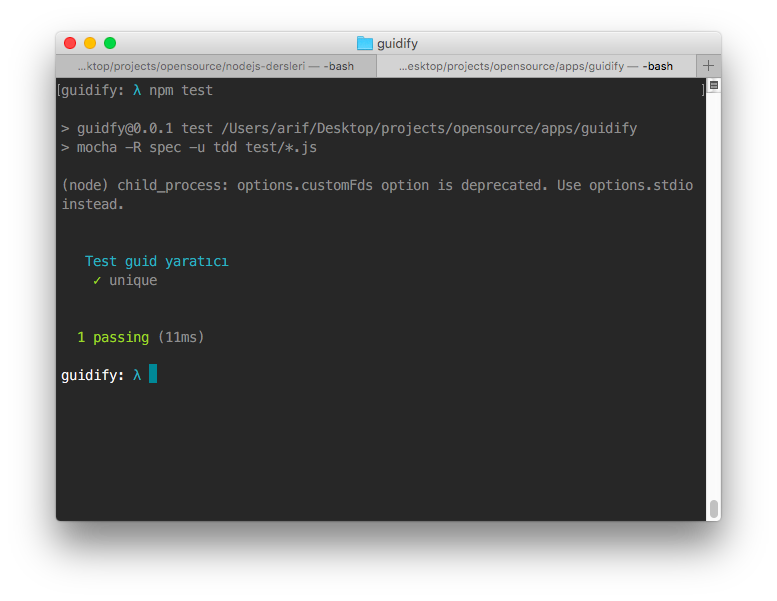

Npm için yapacağımız bu modül her çağırdığımızda bize benzersiz ID'ler üretecek. Modülümüzü oluşturduktan sonra küçük bir test yazaıp onaydan geçirdikten sonra npm sitesine kayıt işlemini yapalım.

----

### Yapılacaklar

* Modülü oluşturalım
* Basit bir test yazalım
* Modulü npm sitesine kayıt ettirelim

Npm init yaparak başlayalım. proje dosyası oluşturup terminalden klasöre erilim daha sonra `npm init` yaparak başlayalım.


```
npm init
```

Modülünüzün ismini, açıklamasını, versiyonunu .etc girdikten sonra package.json dosyamızı oluşturduk.


###  package.json

```
{
  "name": "guidfy",
  "version": "0.0.1",
  "description": "Globally unique identifier",
  "main": "index.js",
  "scripts": {
    "test": "mocha -R spec -u tdd tests/*.js"
  },
  "devDependencies": {
    "mocha": "~1.14.0",
    "should": "^7.1.1"
  },
  "repository": {
    "type": "git",
    "url": "git+https://github.com/arifcakiroglu/guidify.git"
  },
  "keywords": [
    "unique",
    "id",
    "unique",
    "guid",
    "guidify"
  ],
  "author": "Arif Cakiroglu <cakirogluarif@gmail.com>",
  "license": "MIT",
  "bugs": {
    "url": "https://github.com/arifcakiroglu/guidify/issues"
  },
  "homepage": "https://github.com/arifcakiroglu/guidify#readme"
}


```


### index.js

```
module.exports= function(){
  // Anlık tarihi alıp d değişkenine atıyoruz.
  var d = new Date().getTime();

  // 'xxx' uzunluğunda bir çıktı üreteceğiz.
  var guid = 'xxxxxxxxxxxxxxxxxxxx'.replace(/[x]/g, function(c) {
    var r = (d + Math.random()*16)%16 | 0;
    d = Math.floor(d/16);
    return (c=='x' ? r : (r&0x3|0x8)).toString(16);
  });

  // Test edelim çalışıyoru mu diye
  // console.log("Bu ilk guid'imiz %s",guid);
  return guid
};
```

Modülümüzün index dosyasını oluşturduk çalışıp çalışmadığını görmek için `app.js` dosyası oluşturup modülümüzü çağıracağız


### app.js

```
// şimdilik denemek için ./index.js olarak çağırıyoruz npm'e kayıt ettirmeden önce app.js dosyasını sileceğiz

var guidify = require("./index.js");
console.log("Bu ilk guid'imiz %s", guidify());

// Çıktımız bu şekilde oldu. Her denemede farklı bir çıktı alacağız.
// Bu ilk guid'imiz 18dc1f7c0373d09bdc1a

```



Şimdi ise bir test yazalım.

Bunun için `/tests` klasörü açıyorum içerisine `guidify.js` dosyamı oluşturuyorum.

### guidify.js

```
/**
 * Module dependencies.
 */

 // bir üst dizindeki modülümüzü çağırıyoruz
var Guidify = require('../index.js');
var assert = require('assert');

suite('\033[36m Test guid yaratıcı \033[90m', function() {
  test('unique', function(done) {
    var guid = Guidify();
    assert.equal(typeof(guid), 'string', 'Should return a string' );
    assert.equal(guid.length, 20, 'Should return a string with length 20' );
    done();
  });
});
```


### Makefile

Terminalden `make test` ya da `npm test` yazarak testimizi çalıştırıyoruz.




Makefile'ın ne olduğunu ve detaylarını başka bir makalede açıklayacapım. (yazınca buraya linkini eklerim söz)

```
install: package.json
	@npm install

test:
	@./node_modules/.bin/mocha -u tdd

.PHONY: test
```


### Npm kayıt

Geç oldu buna yarın devam ederim :)


### Okuduğunuz için teşekkür ederim.


* [Tüm Github repositorileri](https://github.com/nodejs-dersleri)


---
