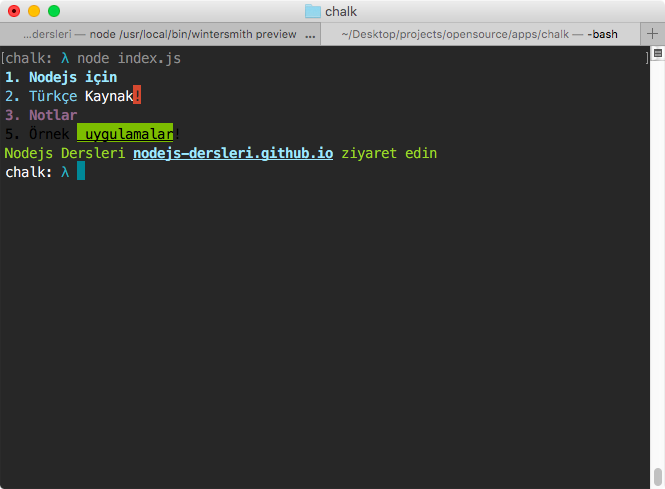
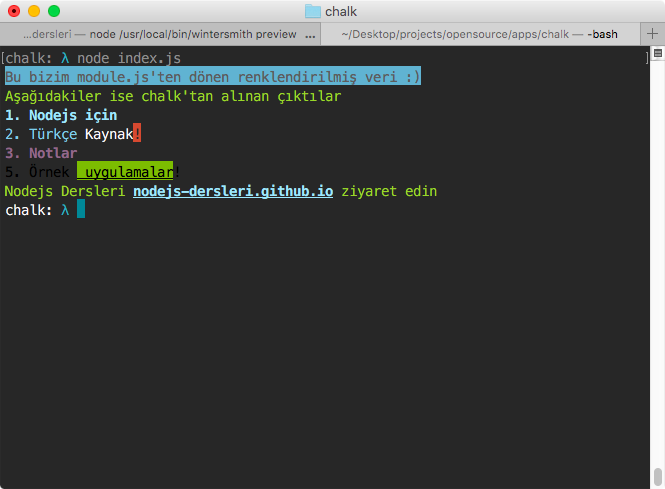

Chalk, colors, cli-color modülleri aslında aynı işe yarıyor. Terminalde verdiğiniz çıktıları renklendirip font'ları ile farkındalık yaratabilirsiniz.

Aralarında bazı farklılıklar olsa da içlerinde hız, api bakımından en iyisi(benim için). İndirilme oranıda epey yüksek, 5700'den fazla [npm modülünde](https://www.npmjs.com/browse/depended/chalk) kullanılmış.

---


> Konuyu iki başlık altında inceleyeceğiz

1. Chalk'ın kullanılışı
2. Chalk gibi bir modül ya da util nasıl yapabiliriz.


</br>
### package.json

```
{
  "name": "chalk-module",
  "version": "1.0.0",
  "main": "index.js",
  "repository" : {
    "type" : "git",
    "url" : "https://github.com/nodejs-dersleri/chalk"
  }
}

```


### index.js

```

'use strict';

/**
 * Bağımlılıkları tanımlıyoruz
 */
var chalk = require('chalk');

/**
 * Aşağıda Niteleyiciler, Renkler ve Arkaplan renklerini bulabilirsiniz
 * Bir kaç örnekle başlayalım.
 */
console.log(
  chalk.blue.bold('1. Nodejs için')
)

/**
 * Inverse: atanan rengi tersine çevirir.
 */
console.log(
  chalk.blue('2. Türkçe') + ' Kaynak' + chalk.inverse.red('!')
)

/**
 * birdern fazla niteleyici ve rengi ard arda kullanabilirsiniz
 */
console.log(
  chalk.blue.magenta.dim.bold('3. Notlar')
)

console.log(
  chalk.black('5. Örnek', chalk.underline.bgGreen(' uygulamalar') + '!')
)

console.log(
  chalk.green(
      'Nodejs Dersleri ' +
      chalk.blue.underline.bold('nodejs-dersleri.github.io') +
      ' ziyaret edin'
  )
);

```


Şimdi terminalden `index.js` dosyamızı çağıralım.

```
node index.js
```




### Niteleyiciler

- `reset`
- `bold`
- `dim`
- `italic` *(yaygın olarak desteklenmiyor)*
- `underline`
- `inverse`
- `hidden`
- `strikethrough` *(yaygın olarak desteklenmiyor)*

### Renkler

- `black`
- `red`
- `green`
- `yellow`
- `blue`
- `magenta`
- `cyan`
- `white`
- `gray`

### Arkaplan renkleri

- `bgBlack`
- `bgRed`
- `bgGreen`
- `bgYellow`
- `bgBlue`
- `bgMagenta`
- `bgCyan`
- `bgWhite`


</br>
</br>

## Kendi modülümüzü yapalım

</br>

> Ansi renk kodları ve niteleyiciler hakkında daha fazla bilgi için [wikipedia](https://en.wikipedia.org/wiki/ANSI_escape_code#graphics)

`module.js` adında bir dosya oluşturalım.

```

'use strict';

module.exports= function(text,type){

  /**
   * Tüm renk ve niteleyici kodları için kaynaklar kısmında link mevcut
   */
  var style = {
    bold:       [1, 22],
    underline:  [4, 24],
    black:      [30, 39],
		red:        [31, 39],
		green:      [32, 39],
    bgBlack:    [40, 49],
		bgRed:      [41, 49],
		bgGreen:    [42, 49],
		bgYellow:   [43, 49],
		bgBlue:     [44, 49]
  }

  function wrap(args) {
    style = style[type];

    /**
    * Aslında yaptığımı şey => \u001b[31m  text  \u001b[m39
    * bu bize kırmızı renkte bir çıktı verecektir.
    */
    var tags = {
       open: '\u001b[' + style[0] + 'm',
       close: '\u001b[' + style[1] + 'm'
     }
    return tags.open + args + tags.close
  }

  return wrap(text)

};

```


Şimdi index dosyamıza şu kodları ekleyelim

```
var renk = require('./module.js');

console.log(
  renk('Bu bizim module.js\'ten dönen renklendirilmiş veri :)','bgBlue') + '\n'  +
  renk('Aşağıdakiler ise chalk\'tan alınan çıktılar','green')
)

```




> Kendi modülümüzü  anlatmak için yaptım. Generic bir yapısı yoktur.


### Kaynaklar

1. http://wiki.bash-hackers.org/scripting/terminalcodes
2. https://en.wikipedia.org/wiki/ANSI_escape_code
3. https://github.com/chalk/chalk

---
