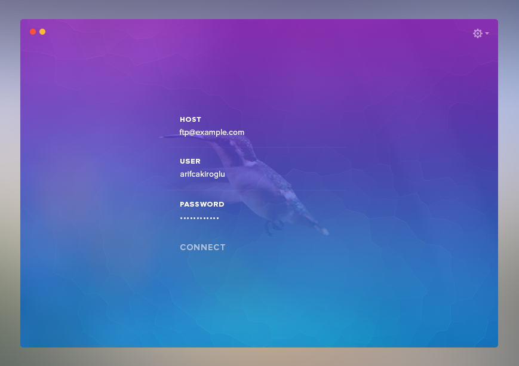
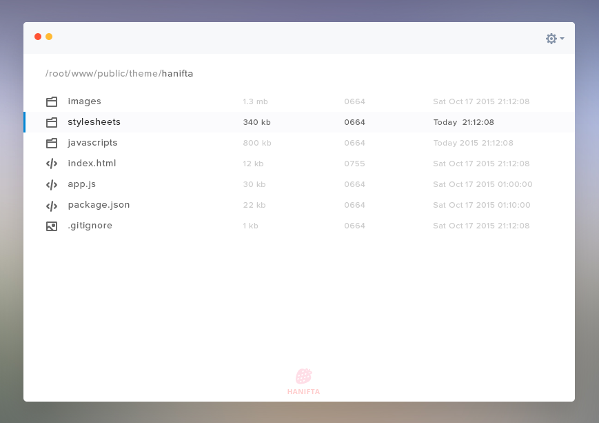
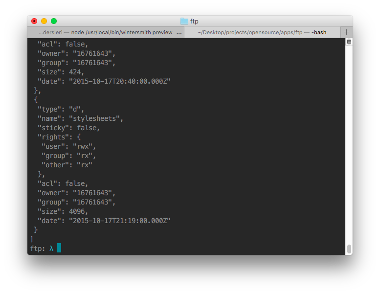

`ftp` modülü standart ftp protokollerini kullanarak ftp server'a bağlantı yapmamızı sağlayan bir modül. Minimal ftp adında bir konu başlığımız mevcut. Bu konuyu videolu olarak anlatmayı düşünüyorum. Şimdilik sadece `ftp` modülünün nasıl çalıştığını anlatacağım.

---

Yapacağımız minimal ftp büyük olasılıkla aşağıdaki görsellere yakın olarak yayınlanacak.






### package.json

Npm init ile başlıyoruz.

```
npm init
```

package.json dosyamız oluştu.
```
{
  "name": "ftp-app",
  "main": "index.js"
  ...
}

```


### index.js

Şimdi `index.js` dosyası oluşturuyoruz.

Test için bir fpt account oluşturmuştum, siz mevcut ftp hesaplarınızı deneyebilirsiniz. Host, user, password olarak bilgilerinizi girdiğinizde bağlantı sağlanacaktır. Eğer herhangi bir host girmezseniz 127.0.0.1:23 ip/portuyla localinize bağlanmayı deneyecektir.


```
// FTP modülünü require ile çağırıyoruz.
var Client = require('ftp');

// yeni bir client oluşturuyoruz.
var client = new Client();

/**
 * account objesine verilerimizi giriyoruz, diğer opsiyonlar (secure vs)
 * için https://www.npmjs.com/package/ftp#methods methods>connect başlığı
 * altında daha fazla bilgi var.
 */

var account = {
  host: "ftp.hostisminiz.com",
  user: "kullaniciadi",
  password : "sifreniz",
}

/**
 * ready: başarılı bir şekilde giriş yapıldığında
 */
client.on('ready', function() {

  /**
   * list: server'daki dosya/file listesini döner
   */
  client.list(function(err, list) {
    if (err) throw err;
    console.log(JSON.stringify(list, null, ' '));
  });

  /**
   * on:error: eğer bağlantıda herhangi bir problem olursa bildirim yapar
   */
  client.on('error', function() {
    console.log('error');
  });

});

/**
 * account objesini connect metoduna gönderip çalıştırıyoruz.
 */
client.connect(account);

```


`client.list` Serverdaki dosyalarımızın listesini döner. Eğer sunucudaki herhangi bir klasöre erişmek isterseniz bunu list fonksiyonuna path olarak girmeniz yeterli.

`client.list('/theme/css/less')` böylelikle istediğiniz klasörü listelemiş olursunuz.

Kendi hostumdan şu şekilde bir çıktı aldım:


```
...
{
  "type": "d",
  "name": "stylesheets",
  "sticky": false,
  "rights": {
   "user": "rwx",
   "group": "rx",
   "other": "rx"
  },
  "owner": "16761643",
  "group": "16761643",
  "size": 4096,
  "date": "2015-10-17T21:19:00.000Z"
 }
...
```


* Type : '-' ya da 'd' olarak döner. - dosya olduğunu, d bir dizin olduğunu gösterir
* Date : son değiştirilme tarihini verir.
* Rights : dosya yazma, okuma izinleri. rwx rx rx olarak çıktı geliyor
* Size : Dosyanın boyutunu kb cinsinden verir.

### Dosya indirme

```
client.get('/javascrip/main.js', function(err) {

});
```

### Dosya gönderme

```
client.put('/javascrip/main.js', function(err) {
   if (err) throw err;
   client.end();
});
```

### Pathname working directory PWD
içerisinde bulunduğunuz path'i verir

```
client.pwd(function(err) {
   if (err) throw err;
});
```


! `FTP` modülü tüm ftp komutlarını içermez.

---

* bkz: [ftp komutlar](https://en.wikipedia.org/wiki/List_of_FTP_commands)
* IETF(internet engineering task force)'in ftp [kontrol listesi](https://www.ietf.org/rfc/rfc959.txt).


---

Minimal ftp uygulamasında daha fazla bilgilendirme yapacağım.


---
