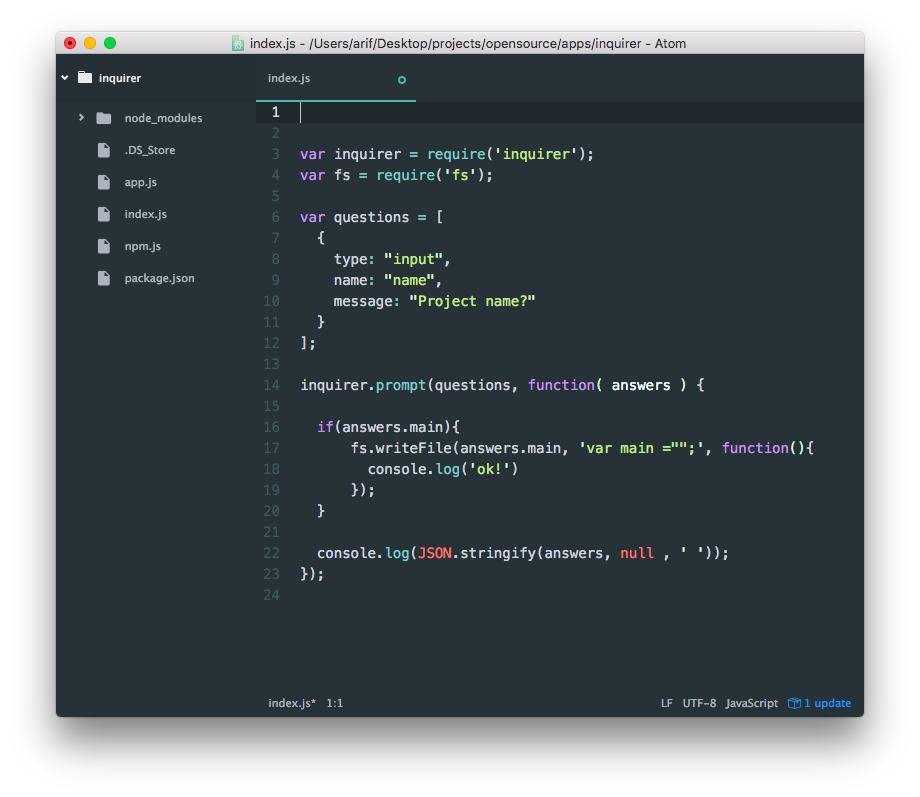

Yeoman ile proje oluşturduğumuzda ya da `npm init` yaptığımızda karşımıza bazı sorular gelir. Inquirerjs'le tam olarak bunu yapcağız.

Kullanıcıya bazı sorular sorup cevaplarına göre işlem yapacağız.

---


[](https://youtu.be/qGWs6qI4sw8)


### package.json

Npm init ile başlıyoruz.

```
npm init
```

package.json dosyamız oluştu.


### index.js

Şimdi `index.js` dosyası oluşturuyoruz.



```
// inquirer modülünü çağırıyoruz
var inquirer = require('inquirer');

// gelen veriye göre bir dosya oluşturacağız bunun içinde `fs` modülünü kullanacağız.
var fs = require('fs');

// Sorularımızı oluşturuyoruz

var  questions = [
  {
    type: "input",
    name: "name",
    message: "Project name?"
  },
  {
    type: "list",
     name: "main",
     message: "Main file",
     choices: [ "app.js", "app2.js", "npm.js" ],
  },
  {
      type: "password",
      name : 'checkbox',
      message : 'Password'
  }
];

// şimdi inquirerjs'i çalıştırıyoruz


inquirer.prompt(questions, function( answers ) {

  // Eğer main dosyası var ise fs ile, seçilen dosyayı oluşturacağız
  if(answers.main){

      // @ oluşturulacak dosya
      // @ dosyaya yazacağımız data
      // @ işlem sonucu
      fs.writeFile(answers.main, 'var main ="";', function(){
        console.log('dosya yazıldı! Şimdi dizininizi kontrol edin')
      });
  }
  console.log(JSON.stringify(answers, null , ' '));
});

```

Çıktı olarak console'a json datayı yazacak ve seçilen dosyayı dizin klasörüne oluşturacak.


### Okuduğunuz için teşekkür ederim.


* [Tüm Github repositorileri](https://github.com/nodejs-dersleri)


---
