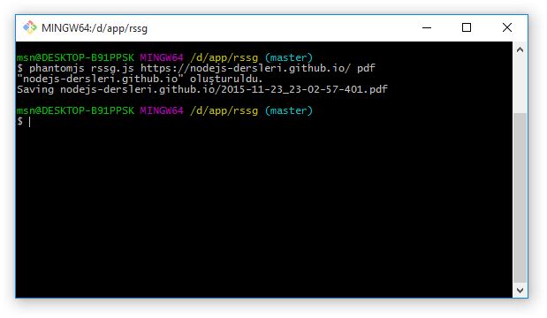
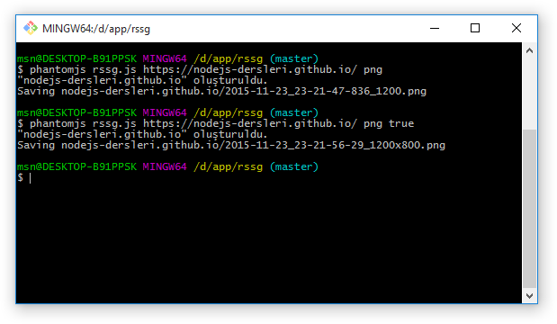

İlk yazımızda ekran görüntüsü almış ve kaydetmiştik, bu yazımızda ise farklı çözünürlüklerde birden çok ekran görüntüsü kaydedeceğiz, bunun yanı sıra script'imize cli'dan gelen paremetrelere farklı davranışlar sergileteceğiz.

----

### rssg.js

Dosyamızın son hali bu şekildeydi, bunun üzerinden devam edeceğiz.

```
var args = require('system').args;
var fs = require('fs');
var page = new WebPage();

if ( 1 === args.length ) {
    console.log('Url addresi girmediniz');
    phantom.exit();
}

var urlAddress = args[1].toLowerCase();

var viewports = [
    {
        width : 1200,
        height : 800
    },
    {
        width : 1024,
        height : 768
    },
    {
        width : 768,
        height : 1024
    },
    {
        width : 480,
        height : 640
    },
    {
        width : 320,
        height : 480
    }
];

page.open(urlAddress, function (status) {
    if ( 'success' !== status ) {
        console.log('Adrese bağlanılamadı.');
    } else {
        var folder = urlToDir(urlAddress);

        page.viewportSize = viewports[0];
        var output = folder + "/" + getFileName();
        console.log('Saving ' + output);
        page.render(output);
    }
    phantom.exit();
});


function urlToDir(url) {
    var dir = url
        .replace(/^(http|https):\/\//, '')
        .replace(/\/$/, '');

    if ( !fs.makeTree(dir) ) {
        console.log('"' + dir + '" oluşturulamadı.');
        phantom.exit();
    }
    console.log('"' + dir + '" oluşturuldu.');
    return dir;
}

function getFileName() {
    var d = new Date();
    var date = [
        d.getUTCFullYear(),
        d.getUTCMonth() + 1,
        d.getUTCDate()
    ];
    var time = [
        d.getHours() <= 9 ? '0' + d.getHours() : d.getHours(),
        d.getMinutes() <= 9 ? '0' + d.getMinutes() : d.getMinutes(),
        d.getSeconds() <= 9 ? '0' + d.getSeconds() : d.getSeconds(),
        d.getMilliseconds()
    ];
    return date.join('-') + '_' + time.join('-') + ".png";
}
```

### Çıktı formatı

şimdide paremetre ile dosyayı kaydedeceğimiz formatı parametre olarak alalım.

urlAddress değişkenimizin altına hemen şu kodu yapıştıralım.

```
var ext = '.' + (args[2] || 'png').toLowerCase();
```

buraki kodu açıklamak gerekirse parantezleri kullanarak işlem önceliğini belirledik, **args[2]** parametresi varsa kullan yoksa **png** kullan dedik daha sonra **toLowerCase** fonskiyonu ile hepsini kucuk yazi haline getirdik en son **.** işareti ile birleştirdik.

#### getFileName 

şimdi burdada ufak bir düzenleme yapalım
```
return date.join('-') + '_' + time.join('-') + ".png";
```
satırını 
```
return date.join('-') + '_' + time.join('-') + ext;
```
ile değiştirelim


```
function getFileName() {
    var d = new Date();
    var date = [
        d.getUTCFullYear(),
        d.getUTCMonth() + 1,
        d.getUTCDate()
    ];
    var time = [
        d.getHours() <= 9 ? '0' + d.getHours() : d.getHours(),
        d.getMinutes() <= 9 ? '0' + d.getMinutes() : d.getMinutes(),
        d.getSeconds() <= 9 ? '0' + d.getSeconds() : d.getSeconds(),
        d.getMilliseconds()
    ];
    return date.join('-') + '_' + time.join('-') + ext;
}
```

```
phantomjs rssg.js https://nodejs-dersleri.github.io/ pdf
```



hangi formatlarda çıktı alabileceğimizi bir önceki yazımızda listemiştik.


### Görüntüyü kırpma

şimdide az önce eklediğimiz **ext** değişkenin altına şu kodu ekleyelim

```
var clipping = args[3] || false;
```

#### getFileName
şimdide fonksiyonumuzda biraz değişiklik yapalım
```
function getFileName(viewport) {
    var d = new Date();
    var date = [
        d.getUTCFullYear(),
        d.getUTCMonth() + 1,
        d.getUTCDate()
    ];
    var time = [
        d.getHours() <= 9 ? '0' + d.getHours() : d.getHours(),
        d.getMinutes() <= 9 ? '0' + d.getMinutes() : d.getMinutes(),
        d.getSeconds() <= 9 ? '0' + d.getSeconds() : d.getSeconds(),
        d.getMilliseconds()
    ];
    var resolution = viewport.width + (clipping ? "x" + viewport.height : '');

    return date.join('-') + '_' + time.join('-') + "_" + resolution + ext;
}
```
yaptığımız değişiklikleri hızlıca özetleyelim, fonksiyonumuz artık bir viewport parametre alıyor ve **resolution** adında yeni bir değişkene sahip bu değişkene ise gelen viewport objesinin width değerini ve clipping varsa height degerini basıyor.

#### bağlantı kodu
```
page.open(urlAddress, function (status) {
    if ( 'success' !== status ) {
        console.log('Adrese bağlanılamadı.');
    } else {
        var folder = urlToDir(urlAddress);
        if ( clipping ) {
            page.clipRect = viewports[0];
        }
        page.viewportSize = viewports[0];
        var output = folder + "/" + getFileName(viewports[0]);
        console.log('Saving ' + output);
        page.render(output);
    }
    phantom.exit();
});
```
Eğer clipping değişkeni false değilse **page.clipRect = viewports[0];** komutunu aktif ediyoruz bu bizim görüntüyü kırpma kodumuz, ve getFileName fonksiyonumuza viewport parametresini gönderdik **getFileName(viewports[0])** 


```
phantomjs rssg.js https://nodejs-dersleri.github.io/ png
```

```
phantomjs rssg.js https://nodejs-dersleri.github.io/ png true
```

bu 2 komutunda sorunsuz çalışması gerekiyor.( eğer çalışmaz yazının devamında mevcut kodlarımızı vereceğim karşılaştırma yapabilirsiniz)



### rssg.js
```
var args = require('system').args;
var fs = require('fs');
var page = new WebPage();

if ( 1 === args.length ) {
    console.log('Url addresi girmediniz');
    phantom.exit();
}

var urlAddress = args[1].toLowerCase();
var ext = '.' + (args[2] || 'png').toLowerCase();
var clipping = args[3] || false;

var viewports = [
    {
        width : 1200,
        height : 800
    },
    {
        width : 1024,
        height : 768
    },
    {
        width : 768,
        height : 1024
    },
    {
        width : 480,
        height : 640
    },
    {
        width : 320,
        height : 480
    }
];

page.open(urlAddress, function (status) {
    if ( 'success' !== status ) {
        console.log('Adrese bağlanılamadı.');
    } else {
        var folder = urlToDir(urlAddress);
        if ( clipping ) {
            page.clipRect = viewports[0];
        }
        page.viewportSize = viewports[0];
        var output = folder + "/" + getFileName(viewports[0]);
        console.log('Saving ' + output);
        page.render(output);
    }
    phantom.exit();
});


function urlToDir(url) {
    var dir = url
        .replace(/^(http|https):\/\//, '')
        .replace(/\/$/, '');

    if ( !fs.makeTree(dir) ) {
        console.log('"' + dir + '" oluşturulamadı.');
        phantom.exit();
    }
    console.log('"' + dir + '" oluşturuldu.');
    return dir;
}

function getFileName(viewport) {
    var d = new Date();
    var date = [
        d.getUTCFullYear(),
        d.getUTCMonth() + 1,
        d.getUTCDate()
    ];
    var time = [
        d.getHours() <= 9 ? '0' + d.getHours() : d.getHours(),
        d.getMinutes() <= 9 ? '0' + d.getMinutes() : d.getMinutes(),
        d.getSeconds() <= 9 ? '0' + d.getSeconds() : d.getSeconds(),
        d.getMilliseconds()
    ];
    var resolution = viewport.width + (clipping ? "x" + viewport.height : '');

    return date.join('-') + '_' + time.join('-') + "_" + resolution + ext;
}
```
### Tüm çözünürlükler

#### bağlantı fonksiyonumuzu güncelleyelim
```
page.open(urlAddress, function (status) {
    if ( 'success' !== status ) {
        console.log('Adrese bağlanılamadı.');
    } else {
        var folder = urlToDir(urlAddress);
        var key, output;

        function render(n) {
            if ( !!n ) {
                key = n - 1;
                page.viewportSize = viewports[key];
                if ( clipping ) {
                    page.clipRect = viewports[key];
                }
                output = folder + "/" + getFileName(viewports[key]);
                console.log('Saving ' + output);
                page.render(output);
                render(key);
            }
        }
        render(viewports.length);
    }
    phantom.exit();
});
```
burada for ile tüm viewports dizisini dönebilirsiniz, ben recursive fonksiyon kullanmayi tercih ettim bunun nedeni bana göre işi biten bir sonraki işlemi tetiklemeli.

```
phantomjs rssg.js https://nodejs-dersleri.github.io/ png true
```


### rssg.js
son olarak kodumuzun son hali.

```
var args = require('system').args;
var fs = require('fs');
var page = new WebPage();

if ( 1 === args.length ) {
    console.log('Url addresi girmediniz');
    phantom.exit();
}

var urlAddress = args[1].toLowerCase();
var ext = '.' + (args[2] || 'png').toLowerCase();
var clipping = args[3] || false;

var viewports = [
    {
        width : 1200,
        height : 800
    },
    {
        width : 1024,
        height : 768
    },
    {
        width : 768,
        height : 1024
    },
    {
        width : 480,
        height : 640
    },
    {
        width : 320,
        height : 480
    }
];

page.open(urlAddress, function (status) {
    if ( 'success' !== status ) {
        console.log('Adrese bağlanılamadı.');
    } else {
        var folder = urlToDir(urlAddress);
        var key, output;

        function render(n) {
            if ( !!n ) {
                key = n - 1;
                page.viewportSize = viewports[key];
                if ( clipping ) {
                    page.clipRect = viewports[key];
                }
                output = folder + "/" + getFileName(viewports[key]);
                console.log('Saving ' + output);
                page.render(output);
                render(key);
            }
        }
        render(viewports.length);
    }
    phantom.exit();
});


function urlToDir(url) {
    var dir = url
        .replace(/^(http|https):\/\//, '')
        .replace(/\/$/, '');

    if ( !fs.makeTree(dir) ) {
        console.log('"' + dir + '" oluşturulamadı.');
        phantom.exit();
    }
    console.log('"' + dir + '" oluşturuldu.');
    return dir;
}

function getFileName(viewport) {
    var d = new Date();
    var date = [
        d.getUTCFullYear(),
        d.getUTCMonth() + 1,
        d.getUTCDate()
    ];
    var time = [
        d.getHours() <= 9 ? '0' + d.getHours() : d.getHours(),
        d.getMinutes() <= 9 ? '0' + d.getMinutes() : d.getMinutes(),
        d.getSeconds() <= 9 ? '0' + d.getSeconds() : d.getSeconds(),
        d.getMilliseconds()
    ];
    var resolution = viewport.width + (clipping ? "x" + viewport.height : '');

    return date.join('-') + '_' + time.join('-') + "_" + resolution + ext;
}
```
### son olarak
İlk yazı biraz uzun sürdüğü için bu yazımızda mümkün olduğunca kısa tutarak devam etmek istedim, kimine göre ilk yazı sıkıcı ve uzun, kimine göre bu yazı yeterince açıklayacı olmayacak diye tahmin ediyorum.
Uzun lafın kısası umarım okuyan herkes için faydalı bir anlatım olmuştur.


---
