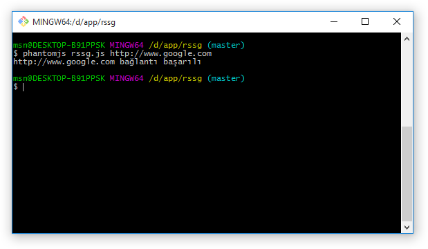
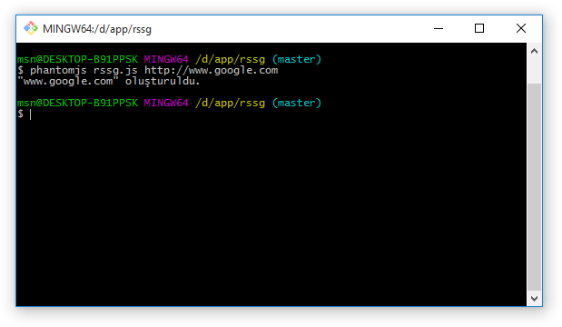
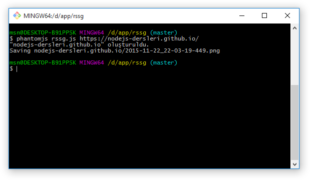
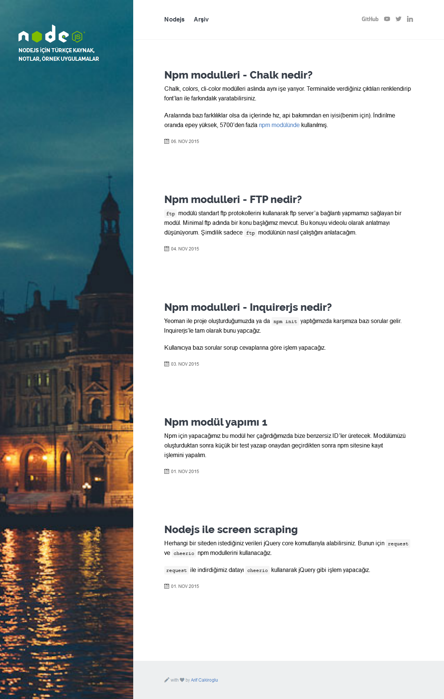

Phantomjs kullanarak cli üzerinden belli bir sayfanın farklı çözünürlüklerdeki görüntüsü kaydedeceğiz.

----

### Gereksinimler

* Phantomjs

Yazacağımız kodlar phantomjs üzerinden çalışacağı için phantomjs'e bağımlıdır, aşşağıdaki adresten phantomjs'i indirip kurabilirsiniz.

http://phantomjs.org/download.html

###  rssg.js

Öncelikle kodlarımızı yazmak için bir dosya açmamız gerekiyor, ben responsive screen shot grabber'ın kısaltması olan **rssg.js** olarak açacağım anlatım boyuncada bunun üzerinden devam edeceğim.

###  system.args
```
var args = require('system').args;
```
Sistem modülünün çeşitli özellikleri mevcut http://phantomjs.org/api/system/ buradan bunlara erişebilirsiniz, bize bu anlatımda sadece **args** özelliği gerekli.

system.args özelliği javascriptten bildiğimiz arguments ile aynı görevi yapmakta, yani girilen her parametreyi bir dizi olarak bize döndürmektedir.

bir örnek ile pekiştiricek olursak;

```
function test(){
    return arguments;
}
var cevap = test(1,2,3)
```
cevap nesnesi bize geriye **[1,2,3]** döndürür, cevap[0] ise **1**;
system.arg'da aynen bu işi yapmakta, phantom js ile örneklendiricek olursak eğer;
```
phantomjs rssg.js https://nodejs-dersleri.github.io/
```
komutu tetiklediğimizde args nesnemiz şu şekilde olacaktır;

['rssg.js', 'https://nodejs-dersleri.github.io/']

dipnot: cli'dan gelen her parametre string formatındadır.

### fs (filesystem)

```
var fs = require('fs');
```

Adındanda anlaşılacağı gibi dosya sistemi api'ı, dosyalar ile ilgili birçok işlemi içinde barındıran mödül.
Mevcut olan tüm api listesine buradan ulaşabilirsiniz http://phantomjs.org/api/fs/

dipnot:kullanılabilir özelliklere yukarıda ki adresden bakınız node.js üzerindeki fs api'ı ile aynı değildir. 


### Webpage
phantomjs'in olmazsa olmazı diyebiliriz.
sayfalarımızı bu api sayesinde acip ekran görüntüsünü alacağız

```
var page = new WebPage();
```
tüm api listesine buradan ulaşabilirsiniz http://phantomjs.org/api/webpage/

### Url varmı ?

```
if ( 1 === args.length ) {
    console.log('Url adresi girmediniz');
    phantom.exit();
}
```
yukarıdaki kodu açıklayacak olursak;
* herşeyden önce if koşulu size biraz farklı gelmiş olabilir **Yoda conditions** jargonu diye geçer ve çeşitli avantajları vardır (ben henüz bir dezavantajını görmedim) bunları ilgili wikipedia sayfasından ve çeşitli kaynaklardan bulabilirsiniz https://en.wikipedia.org/wiki/Yoda_conditions
* **1 === args.length**
unutmayın ilk parametre dosyamızın adı eğer length 1'e eşit ise args nesnem **['rssg.js']** şeklindedir herhangi bir parametre girilmemiş, dolasıyla bağlanacak bir url adresimiz yok demektir.
* eğer koşulumuz sağlanırsa **phantom.exit();** ile işlemleri sonlandırıyoruz.

### url address
```
var urlAddress = args[1].toLowerCase();
```
Unutmayın gelen her parametre string (kullanıcı 1 değerini girmiş olsa bile string olarak geleceği için string mi diye kontrol etmemize gerek yok), dolasıyla string nesnesinin her özelliğini kullanabiliriz.
Daha sonra bu url adresini klasör oluştururken'de kullanacağız o yüzden düzenli bir yapı elde etmek için gelen adresi toLowerCase() ile tümünü küçük harflere çeviriyoruz.

### çözünürlükler
Hangi çözünürlüklerde çıktılar alacağımızı belirleyeceğimiz bir dizi yaratıyoruz.
```
var viewports = [
    {
        width : 1200,
        height : 800
    },
    {
        width : 1024,
        height : 768
    },
    {
        width : 768,
        height : 1024
    },
    {
        width : 480,
        height : 640
    },
    {
        width : 320,
        height : 480
    }
];
```


### rssg.js

karışıklıkların önüne geçmek için dosyamızın şuanki hali şu şekilde olmalı.
```
var args = require('system').args;
var fs = require('fs');
var page = new WebPage();

if ( 1 === args.length ) {
    console.log('Url adresi girmediniz');
    phantom.exit();
}

var urlAddress = args[1].toLowerCase();

var viewports = [
    {
        width : 1200,
        height : 800
    },
    {
        width : 1024,
        height : 768
    },
    {
        width : 768,
        height : 1024
    },
    {
        width : 480,
        height : 640
    },
    {
        width : 320,
        height : 480
    }
];

```

### Test Zamanı
```
page.open(urlAddress, function (status) {
    if ( 'success' !== status ) {
        console.log('Adrese bağlanılamadı.');
    } else {
        console.log(urlAddress, 'bağlantı başarılı');
    }
    phantom.exit();
});
```
Bu kodu'da ekledikten sonra **phantomjs rssg.js http://www.google.com**
komutu ile terminalden kontrol ediyoruz


### klasör oluşturalım
ilk önce url adresini klasör adına dönüştürcek ve oluşturcak bir fonksiyon yazalım
```
function urlToDir(url) {
    var dir = url
        .replace(/^(http|https):\/\/, '')
        .replace(/\/$/, '');

    if ( !fs.makeTree(dir) ) {
        console.log('"' + dir + '" oluşturulamadı.');
        phantom.exit();
    }
    console.log('"' + dir + '" oluşturuldu.');
    return dir;
}
```

kısaca fonksiyonumuzu açıklayalım,
* fonksiyonumuz 1 parametre alıyor ve bunun url adresi olması bekleniyor
* gelen url adresi regex kullanarak replace methodu yardımıyla temizleniyor ve **dir** değişkenine aktarılıyor.
    * /^(http|https):\/\/ **http://** yada **https://** ile başyalanları demek anlamına geliyor
    * /\/$/ **/** ile bitenler anlamına geliyor
* fs.makeTree() fonksiyonu string alir ve boolean bir değer döner aldığı string paremetreye göre klasör oluşturur http://phantomjs.org/api/fs/method/make-tree.html
    * if ( !fs.makeTree(dir) ) az önce oluşturduğumuz path i verdik eğer ki klasörü oluşturursa geriye true değerini dönecek bu bizim istediğimiz sonuç gelen sonuçu tersine ceviriyoruz true ise false, false ise true yapıyoruz. fonksiyonunun bize false donmesi durumunda if koşulu true olucak ve içeriye giricek.
    bu durumda console'a klasör oluşturulamadı diyip phantomjs'den çıkış yapıyoruz.
    * eğer ki if koşulu gerçekleşmez ise geriye path'i (klasör yolunu) döndürüyoruz.
    
    
bağlantı kodunu güncelleyelim
```
page.open(urlAddress, function (status) {
    if ( 'success' !== status ) {
        console.log('Adrese bağlanılamadı.');
    } else {
        var folder = urlToDir(urlAddress);
    }
    phantom.exit();
});
```

```
phantomjs rssg.js http://www.google.com
```



 ve dizinimizde klasör oluşmuş olması gerekiyor.
 
### dosya adı
Aynı sayfa için birçok defa deneme yapılabileceği için benzersiz dosya isimleri oluşturmamız lazım ve aralarındaki farkları görmek açısından bence tarihe göre dosya isimlendirmesi yapmak mantıklı olur.


```
function getFileName(viewport) {
    var d = new Date();
    var date = [
        d.getUTCFullYear(),
        d.getUTCMonth() + 1,
        d.getUTCDate()
    ];
    var time = [
        d.getHours() <= 9 ? '0' + d.getHours() : d.getHours(),
        d.getMinutes() <= 9 ? '0' + d.getMinutes() : d.getMinutes(),
        d.getSeconds() <= 9 ? '0' + d.getSeconds() : d.getSeconds(),
        d.getMilliseconds()
    ];
    return date.join('-') + '_' + time.join('-') + ".png";
}

```
yukarıdaki kod'da çok fazla açıklanacak birşey yok aslında sadece sürekli **+** ile concat etmek yerine parçaları diziye atayıp **-** ile birleştiriyorum.

### ilk ekran görüntüsü için son hazırlık
bağlantı kodumuzu şu şekilde güncelleyelim

```
page.open(urlAddress, function (status) {
    if ( 'success' !== status ) {
        console.log('Adrese bağlanılamadı.');
    } else {
        var folder = urlToDir(urlAddress);

        page.viewportSize = viewports[0];
        var output = folder + "/" + getFileName();
        console.log('Saving ' + output);
        page.render(output);
    }
    phantom.exit();
});
```
Yeni gelen komutlarımızı tanıyalım webpage modülünün linkini yukarı belirtmiştim zaten, detaylı bakmak için yukarıda bağlantıyı kullanabilirsiniz.

* **page.viewportSize** sayfa görünüm boyutunu ayarlamak için kullanılıyor. http://phantomjs.org/api/webpage/property/viewport-size.html
* **page.render** sayfayı kaydetmet için kullanılıyor çıktı formatları http://phantomjs.org/api/webpage/method/render.html
    * PNG
    * GIF
    * JPEG
    * PDF

### rssg.js
dosyamızın son hali bu şekilde olmalı
```
var args = require('system').args;
var fs = require('fs');
var page = new WebPage();

if ( 1 === args.length ) {
    console.log('Url addresi girmediniz');
    phantom.exit();
}

var urlAddress = args[1].toLowerCase();

var viewports = [
    {
        width : 1200,
        height : 800
    },
    {
        width : 1024,
        height : 768
    },
    {
        width : 768,
        height : 1024
    },
    {
        width : 480,
        height : 640
    },
    {
        width : 320,
        height : 480
    }
];

page.open(urlAddress, function (status) {
    if ( 'success' !== status ) {
        console.log('Adrese bağlanılamadı.');
    } else {
        var folder = urlToDir(urlAddress);

        page.viewportSize = viewports[0];
        var output = folder + "/" + getFileName();
        console.log('Saving ' + output);
        page.render(output);
    }
    phantom.exit();
});


function urlToDir(url) {
    var dir = url
        .replace(/^(http|https):\/\//, '')
        .replace(/\/$/, '');

    if ( !fs.makeTree(dir) ) {
        console.log('"' + dir + '" oluşturulamadı.');
        phantom.exit();
    }
    console.log('"' + dir + '" oluşturuldu.');
    return dir;
}

function getFileName() {
    var d = new Date();
    var date = [
        d.getUTCFullYear(),
        d.getUTCMonth() + 1,
        d.getUTCDate()
    ];
    var time = [
        d.getHours() <= 9 ? '0' + d.getHours() : d.getHours(),
        d.getMinutes() <= 9 ? '0' + d.getMinutes() : d.getMinutes(),
        d.getSeconds() <= 9 ? '0' + d.getSeconds() : d.getSeconds(),
        d.getMilliseconds()
    ];
    return date.join('-') + '_' + time.join('-') + ".png";
}
```
eğer herşey doğru ise ilk ekran görüntümüzü alalım.

### ilk ekran görüntüsü
```
phantomjs rssg.js https://nodejs-dersleri.github.io/
```


klasörümüzde ise aşşağıdaki gibi bir ekran görüntüsü olması gerekiyor.


Gördüğünüz gibi ekran görüntüsü hazır ama bir problem var viewports dizimizin ilk nesnesini gönderdik yani 
```
{
    width : 1200,
    height : 800
}
```
fakat çıktıda yükseklik 800px değil, aslında olması gereken sonuç tam olarakta bu;
viewports dediğimiz şey aslında bir nevi pencere boyutu yani 1200x800 bir çözünürlükte siteyi açtiğinizda sitenin Y eksininde sadece 800px'lik kısmını görüyorsunuz? hayır scroll yaparak tüm yükseklikte gezmeniz mümkün
burdaki sonuçta aynen bu.
bir sonraki yazımızda hem farklı boyutlarda hemde görüntüyü kırparak ve bunları paremetrelere dayalı olarak yapacağız.

---
